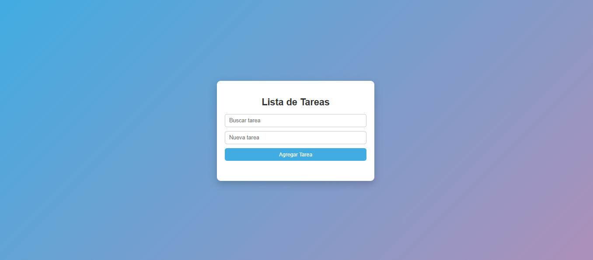

## TAREA N°5

## DECRIPCION 
Aplicación web desarrollada con React y Vite que permite gestionar una lista de tareas.  
Incluye funcionalidades para agregar, marcar como completadas, eliminar y filtrar tareas mediante un buscador.

## Lenguajes utilizados 
- React
- Vite
- JavaScript
- CSS

## Clonar el repositorio

### 1. Clonar el repositorio

git clone https://github.com/usuario/nombre-del-repo.git

## 2. Ingresar a la carpeta del proyecto

cd nombre-del-proyecto

## 3. Instalar dependencias
npm install

## 4. Ejecutar la aplicación

npm run dev

## ----------------------

## AUTOR

NOMBRE: Carlos Rodriguez
UNIDAD: Modulo 2 - Unidad 1

## Fuentes

-Preguntas y dudas a CHATGPT
-Tutorial React hooks | Todos los React hooks explicados (https://www.youtube.com/watch?v=jaLl4ErmU44&t=948s)
-¿Qué son los hooks? (https://lenguajejs.com/react/componentes/hooks/)