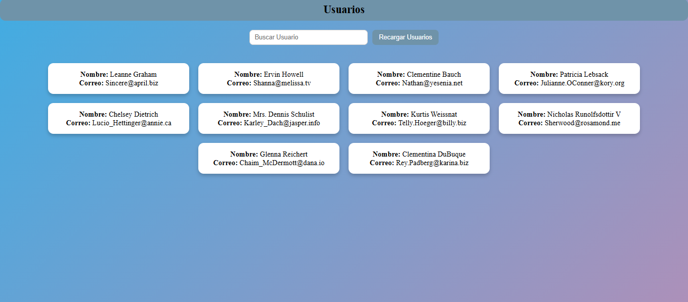

## TAREA N°4 

## DECRIPCION 
Aplicación web en React que muestra y filtra usuarios obtenidos desde una API pública, utilizando componentes reutilizables y hooks
## Lenguajes utilizados 
- React
- Vite
- JavaScript
- CSS

## Clonar el repositorio

### 1. Clonar el repositorio

git clone https://github.com/Carlosss8/Tareas-UTN.BA/tree/main/TareasUTNBA/My-task-N6

## 2. Ingresar a la carpeta del proyecto

cd My-task-N6

## 3. Instalar dependencias
npm install

## 4. Ejecutar la aplicación

npm run dev

## ----------------------

## AUTOR

NOMBRE: Carlos Rodriguez
UNIDAD: Modulo 2 - Unidad 2

## Fuentes

MDN Web docs :  https://developer.mozilla.org/es/