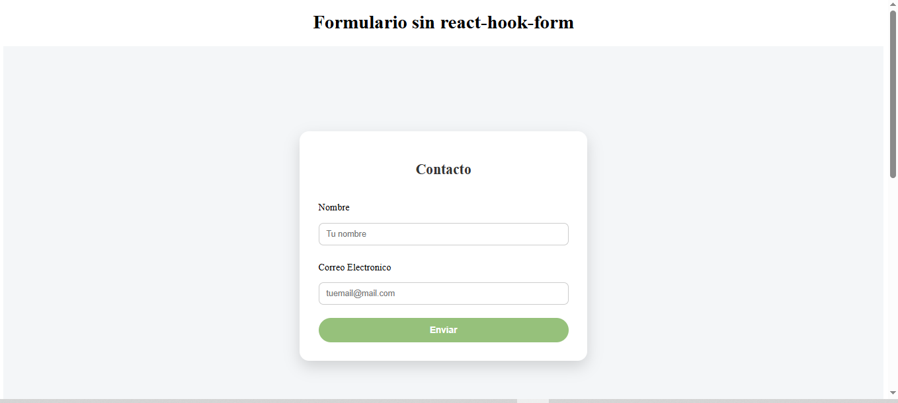
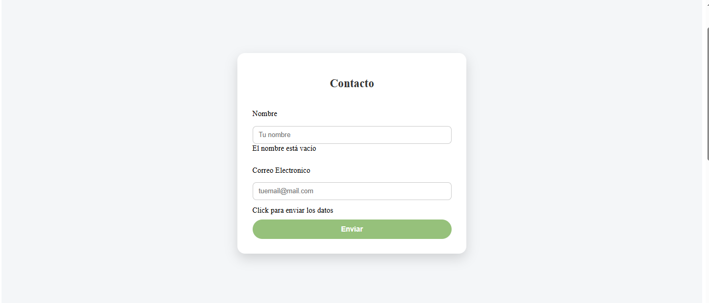
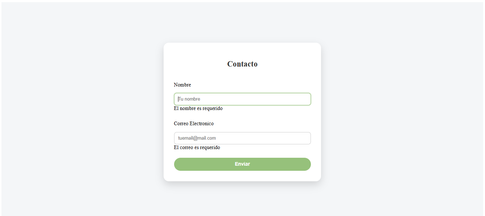

## TAREA N°7

## DESCRIPCION 
2 formularios, desarrollada con React y Vite que permite registrar el nombre y email, el primer formulario es a base de un form puro con varios eventos encima EJ: onChange, onBlur, onSubmit, etc. , este formulario no te permite enviar antes que primero pongas tu nombre con un mensaje  y con un enfoque en el boton Enviar que deja un msj "Click para enviar los datos", en el segundo formulario es mas avanzado echo con react-hook-form, codigos mas proligos y legible con un mensaje que no se puede enviar el formulario antes que llenes los 2 casilleros , en este caso usamos register, handleSubmit, formState: { errors }, reset, todo con useForm para usar el formulario.

## Lenguajes utilizados 
- React
- Vite
- JavaScript
- CSS

## Clonar el repositorio

### 1. Clonar el repositorio

git clone https://github.com/Carlosss8/Tareas-UTN.BA/tree/main/TareasUTNBA/My-task-N8

## 2. Ingresar a la carpeta del proyecto

cd My-task-N8

## 3. Instalar dependencias
npm install

## 4. Ejecutar la aplicación

npm run dev

## AUTOR

NOMBRE: Carlos Rodriguez
UNIDAD: Modulo 2 - Unidad 4

## Fuentes

-React Hook Form Tutorial (https://fazt.dev/contenido/react-hook-form)
-React-hook-form (https://react-hook-form.com/)
-Plantillas de form (https://plantillashtmlgratis.com/)

## Ejercicios y PostData

https://cursos.utnba.centrodeelearning.com/pluginfile.php/923745/mod_assign/introattachment/0/Tarea%20-%20Eventos.pdf?forcedownload=1
