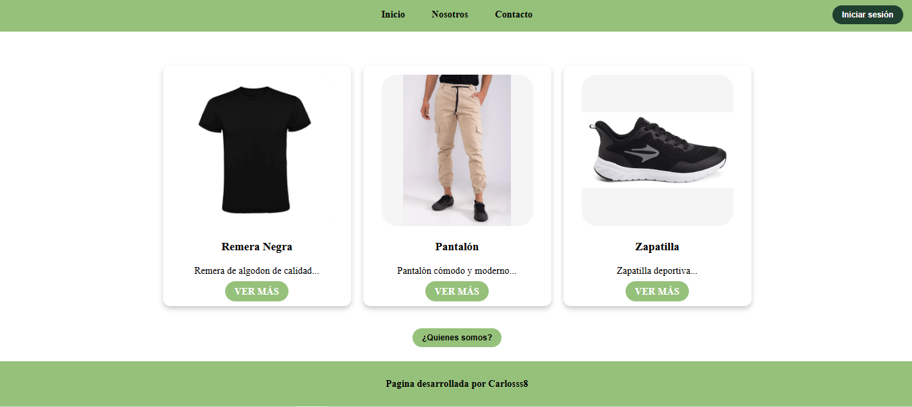

## TAREA N°7

## DECRIPCION 
Mini aplicación web estilo tienda de ropa y sencilla que simula una tienda de ropa, desarrollada con React y Vite que permite navegar entre distintas paginas para poder ver los distintos articulos presionando el boton "VER MAS", pero antes de poder ver los articulos tenes que iniciar sesion que esto esta esta protegido por un "ProtectedRoute" que maneja el login , ademas tenemos un footer y navbar que tiene para navegar sus distintas paginas (Inicio, Nosotros, Contacto), Pantalla de Login Protegida Cuando el usuario entra por primera vez, debe iniciar sesión para poder ver los productos. .
Detalle de Producto Dinámico
Al hacer clic en “VER MÁS”, se navega a una ruta dinámica que muestra la información de ese producto en particular utilizando un parámetro de ruta (/producto/:id). Esto se maneja mediante el hook useParams() que obtiene el id desde la URL y permite mostrar solo los datos de ese producto. 
Medium

Contacto: formulario de contacto
Los enlaces están organizados con el componente <Link /> de React Router para una navegación fluida. 

Footer Común y basico.

## Lenguajes utilizados 
- React
- Vite
- JavaScript
- CSS

## Clonar el repositorio

### 1. Clonar el repositorio

git clone https://github.com/Carlosss8/Tareas-UTN.BA/tree/main/TareasUTNBA/My-task-N7

## 2. Ingresar a la carpeta del proyecto

cd My-task-N7

## 3. Instalar dependencias
npm install

## 4. Ejecutar la aplicación

npm run dev

## AUTOR

NOMBRE: Carlos Rodriguez
UNIDAD: Modulo 2 - Unidad 3

## Fuentes

-Preguntas y dudas a CHATGPT (Pedi que me ayude hacer un form.css sencillo y rapido)
-Fuction React Router (https://api.reactrouter.com/v7/functions/react_router.Outlet.html)
-UseSearchParams (https://reactrouter.com/api/hooks/useSearchParams)
-Plantillas de form (https://plantillashtmlgratis.com/)

## Ejercicios y PostData
[text](<../../../../Modulo 2 - Unidad 3/Tarea - Enrutamiento.pdf>)

Por lo personal esta actividad me gusto mucho y me hizo pensar mas de lo que venia haciendo, agregando nuevas funciones y como se maneja el enrutamiento que es muy distinto y a la vez similiar en algunos casos a lo que venia aprendiendo yo (.NET, C#, C++, Java) me gusto la parte de entender como usar las rutas protegidas y conectando todo con el layout.jsx.